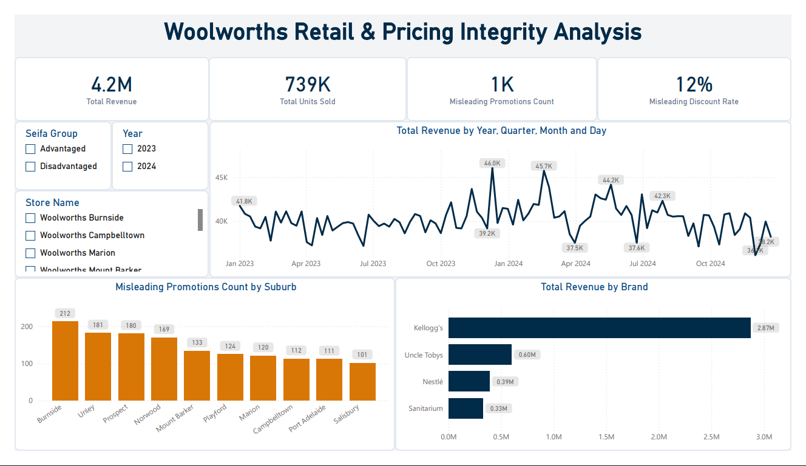

# Woolworths Retail & Pricing Integrity Dashboard

> 👈 **Click the image above to open and interact with the live dashboard!**

## Key Project Features
* **Data Pipeline**: Cleaned locale date mismatches and structured a retail transaction model in Power Query.
* **DAX Formulas**: Built explicit measures for Total Revenue, Units Sold, and Misleading Discount Rates.
* **Interactive Design**: Executive KPI scorecards, drill-down Matrix table, and automated compliance alert highlighting.
